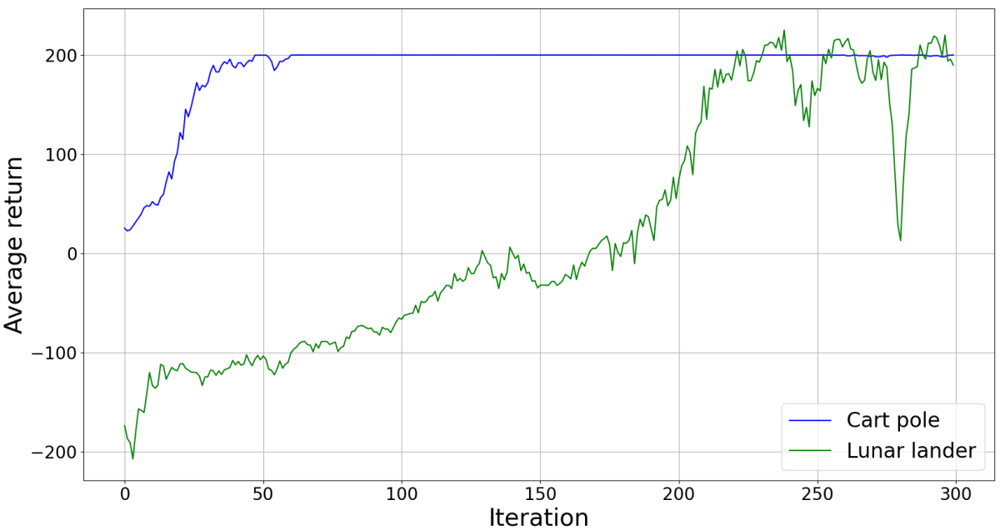
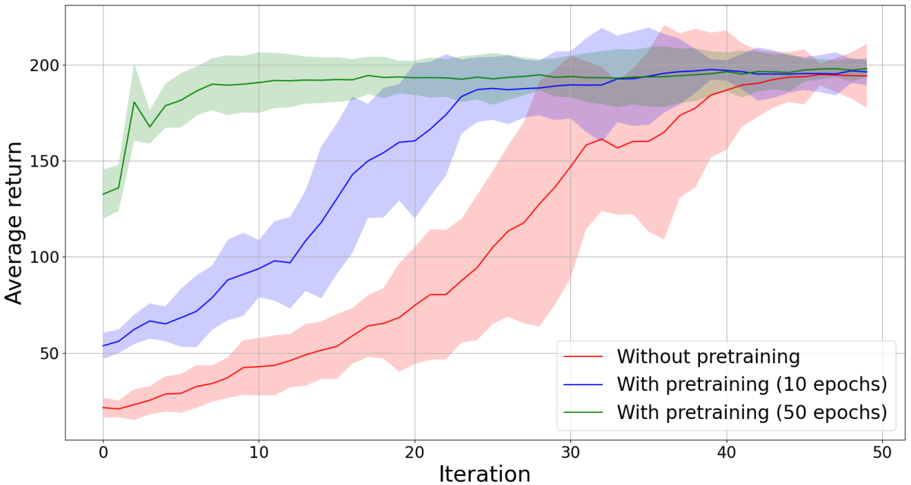
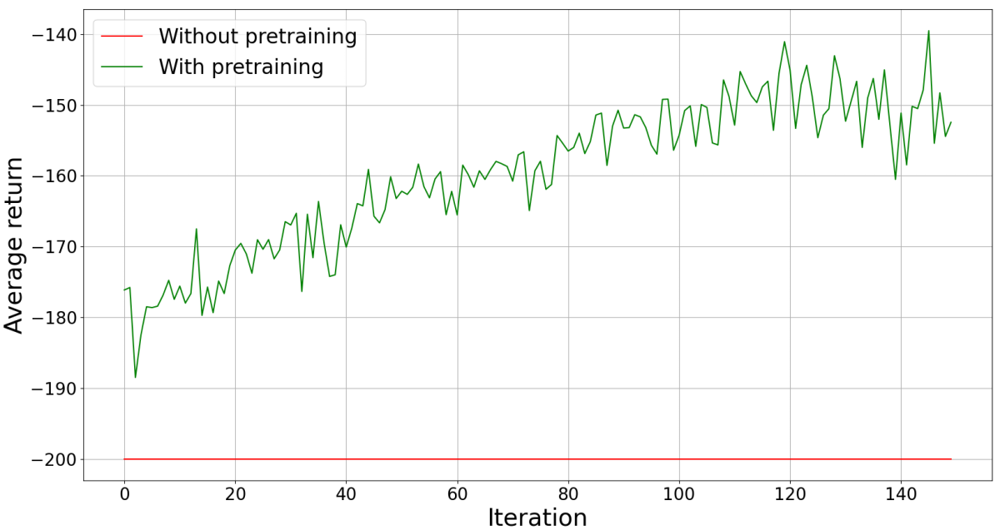

Proximal Policy Optimization (PPO)
==================================

The implementation of PPO generally follows the original description of the algorithm in::

    J. Schulman, F. Wolski, P. Dhariwal, A. Radford, and O. Klimov,
    "Proximal Policy Optimization Algorithms", CoRR,
    vol. abs/1707.06347, 2017.

but does not use a baseline value, i.e. I currently don't estimate the value function in my implementation.

Only a discrete policy is supported in the current implementation, such that the policy network has a single hidden layer.

-------------------
Running the learner
-------------------

As in the case of :doc:`REINFORCE <reinforce>`, a test script for running the PPO learner is provided under ``scripts/test`` and can be used as follows::

    python3 scripts/test/ppo_test.py --env
                                     --number_of_iterations
                                     --episodes_per_iteration
                                     --eps
                                     --training_runs
                                     --debug
                                     [--hidden_units]
                                     [--pretrained_model_path]

The arguments are described below::

    --env -env
        Name of an OpenAI gym environment
    --number_of_iterations -i
        Number of training iterations (i.e. number of times
        the policy network is updated)
    --episodes_per_iteration -e
        Number of episodes per training iterations (i.e. number
        of episodes before updating the policy network)
    --eps -eps
        Epsilon value used for defining a clipping range
    --training_runs -r
        Number of times to repeat the training
    --debug -d
        Flag indicating whether to print debugging messages
        to the terminal
    --hidden_units -hu
        Number of hidden units in the policy network (default 32)
    --pretrained_model_path -pm
        Path to a pretrained model for initialising
        the policy network (default None)

For instance, the following command can be used to train an agent on the cart pole problem a single time for 100 iterations and with 60 episodes per iteration, using an epsilon value of 0.2 and printing debugging messages in the process::

    python3 ppo_test.py -env CartPole-v0 -i 50 -e 60 -r 10 -eps 0.2 -d

--------------------
Implementation Tests
--------------------

I have tested the implementation on the `cart pole <https://github.com/openai/gym/blob/master/gym/envs/classic_control/cartpole.py>`_ and `lunar lander <https://github.com/openai/gym/blob/master/gym/envs/box2d/lunar_lander.py>`_ problems. The average returns obtained by policies trained for 300 iterations with 60 episodes per iteration and with an epsilon value of 0.2 are shown below:

Compared to REINFORCE, PPO generally leads to a more stable evolution of the return, which is to be expected given that the algorithm aims to prevent large policy updates.

----------------------
Effects of Pretraining
----------------------

As in the case of :doc:`REINFORCE <reinforce>`, I have also performed an evaluation of the effect of policy pretraining on the training process. The evalution conditions are exactly the same as in the REINFORCE case, namely pretraining is done using behavioural cloning and three policy networks are trained (one without pretraining and two with pretraining, differing in the number of pretraining epochs), using an epsilon value of ``0.2`` in all cases. The results of the comparison are shown in the figure below:

The results are similar as in the case of REINFORCE, but PPO leads to a smaller training variance (the variance should be even smaller if a baseline value is included).

Once again, the benefit of pretraining is more visible on the `mountain car <https://github.com/openai/gym/blob/master/gym/envs/classic_control/mountain_car.py>`_ problem (results in the figure below), where the agent is not making any learning process if it is trained from scratch, but makes at least some constant progress with a pretrained policy.

