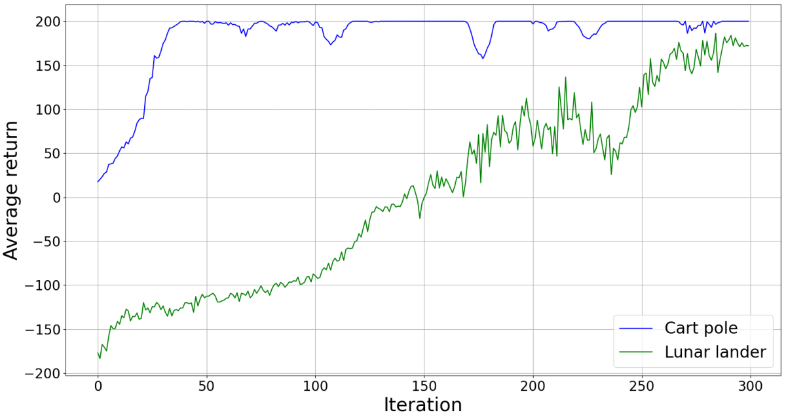
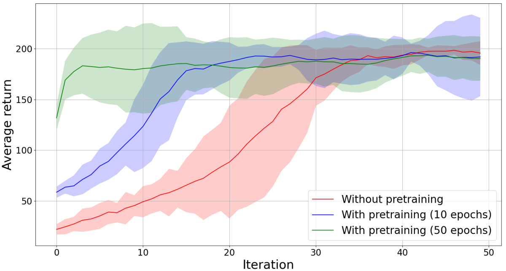
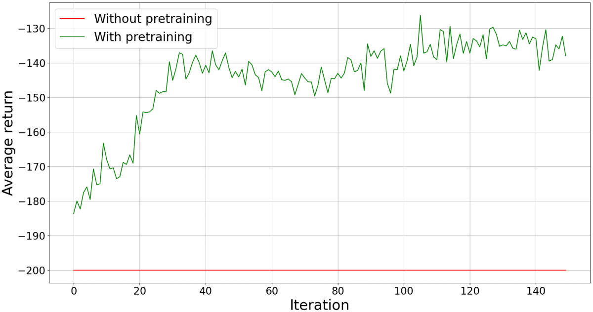

REINFORCE
=========

The REINFORCE implementation is based on the `OpenAI Spinning Up tutorial <https://spinningup.openai.com/en/latest/spinningup/rl_intro3.html>`_.

The current implementation supports a discrete policy, such that the policy network contains a single hidden layer.

-------------------
Running the learner
-------------------

A test script for running the REINFORCE learner is provided under ``scripts/test`` and can be used as follows::

    python3 scripts/test/reinforce_test.py --env
                                           --number_of_iterations
                                           --episodes_per_iteration
                                           --training_runs
                                           --hidden_units
                                           --debug
                                           [--pretrained_model_path]

The arguments are described below::

    --env -env
        Name of an OpenAI gym environment
    --number_of_iterations -i
        Number of training iterations (i.e. number of times
        the policy network is updated)
    --episodes_per_iteration -e
        Number of episodes per training iterations (i.e. number
        of episodes before updating the policy network)
    --training_runs -r
        Number of times to repeat the training
    --hidden_units -hu
        Number of hidden units in the policy network (default 32)
    --debug -d
        Flag indicating whether to print debugging messages
        to the terminal
    --pretrained_model_path -pm
        Path to a pretrained model for initialising
        the policy network (default None)

For instance, the following command can be used to train an agent on the cart pole problem a single time for 100 iterations and with 60 episodes per iteration, printing debugging messages in the process::

    python3 reinforce_test.py -env CartPole-v0 -i 100 -e 60 -r 1 -d

--------------------
Implementation Tests
--------------------

I have performed some tests of the implementation on two standard gym environments: `cart pole <https://github.com/openai/gym/blob/master/gym/envs/classic_control/cartpole.py>`_ and `lunar lander <https://github.com/openai/gym/blob/master/gym/envs/box2d/lunar_lander.py>`_. A plot of the average returns obtained while training policies for 300 iterations with 60 episodes per iteration are shown below:

Particularly for lunar lander, the training is not always so stable, namely it can happen that, in some training runs, the return suddenly drops below 0 and the agent is unable to recover from that. This plot nevertheless illustrates that it is possible to find optimal policies using the algorithm.

----------------------
Effects of Pretraining
----------------------

I have additionally performed an evaluation of how initialising a policy with a pretrained model affects the training process. For pretraining, I used behavioural cloning, namely I pretrained a policy network to simply output actions from manually recorded demonstrations (using a mean squared error loss for network training). An illustrative comparison is shown for the cart pole problem, for which I have trained three policies:

* a policy trained from scratch
* a policy pretrained with behavioural cloning for 10 epochs (with batch size ``4`` and initial learning rate ``0.001``)
* a policy pretrained with behavioural cloning for 50 epochs (again, with batch size ``4`` and initial learning rate ``0.001``)

Each of these policies was trained ``10`` times for ``50`` iterations and with ``60`` episodes per iteration; the policy networks had ``32`` hidden units in all cases. The following figure shows the results of this comparison (the shaded regions represent 95% confidence intervals):

As can be seen from this plot, pretraining can significantly improve the speed at which the agent reaches acceptable performance. This effect is stronger if the policy is pretrained for longer, which means that it would reproduce the teacher better; a potential risk of this is that the agent may overfit the teacher's policy.

In some cases, pretraining can make the difference between making learning progress and getting stuck in the process. For example, the following plot shows the average returns on the `mountain car <https://github.com/openai/gym/blob/master/gym/envs/classic_control/mountain_car.py>`_ problem with and without pretraining.

As can be seen, the agent is unable to learn anything if the policy is learned from scratch, but makes at least some progress if the agent starts from a pretrained policy.

This is a particularly important lesson for robotics, where, for most problems of interest, only sparse reward is available and finding valid solution without any prior knowledge can be quite difficult.
